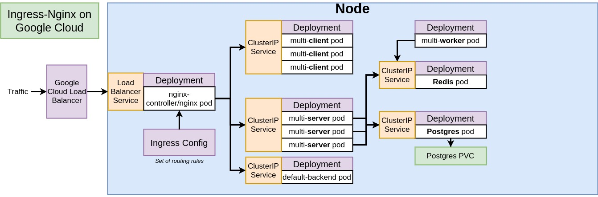
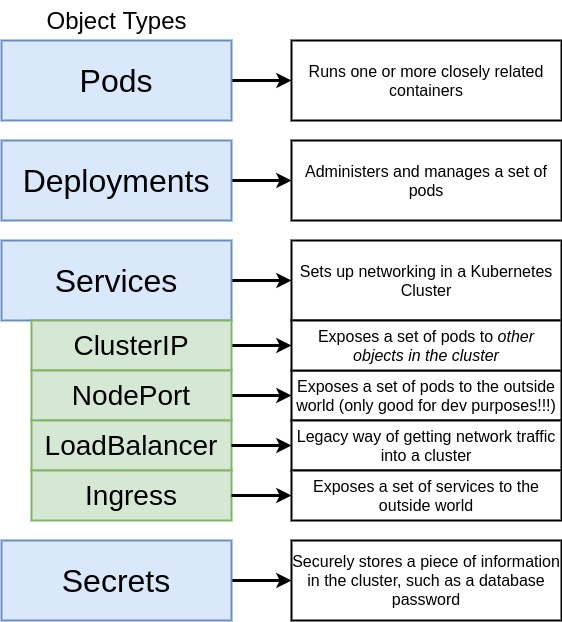

# Multi-container Deployment with Kubernetes on GCP

## Table of Contents

- [General info](#general-info)
- [Project Overview](#project-overview)
- [Setup](#setup)
- [To-do List](#To-do-List)
- [Reference](#reference)

## General Info

This repository contains a project from the course, [Docker and Kubernete: The Complete Guide](https://www.udemy.com/docker-and-kubernetes-the-complete-guide). The project aims to build a simple web application using the [Google Cloud Platform](https://cloud.google.com/) (GCP), which the first mover to support [Kubernetes](https://kubernetes.io/) (K8S).

## Project Overview

Above figure shows the architecture of this project.
The architecture has a single node and is comprised of the several K8S objects, listed in the below figure.
In the [k8s](k8s) directory, you could find the all .yaml files, describing the object spec of the project target architecture.

[1] Stephen's Github (https://github.com/StephenGrider/DockerCasts/tree/master/diagrams)
